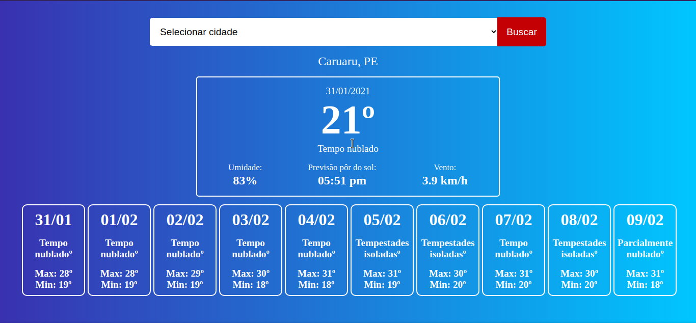
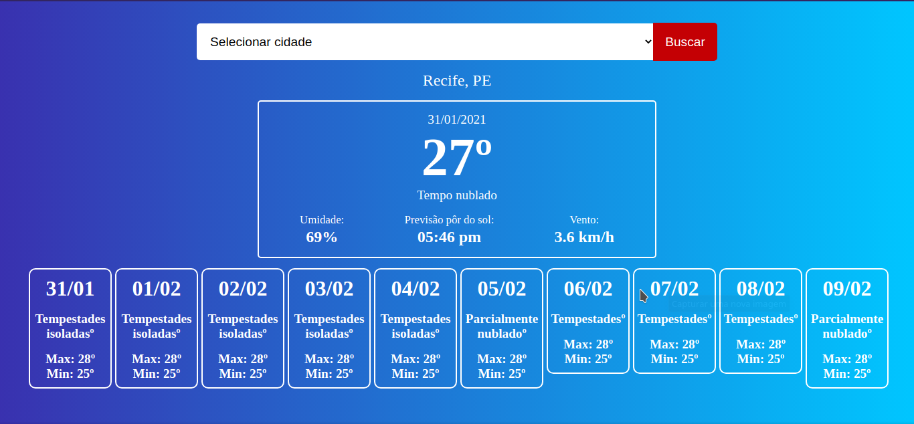
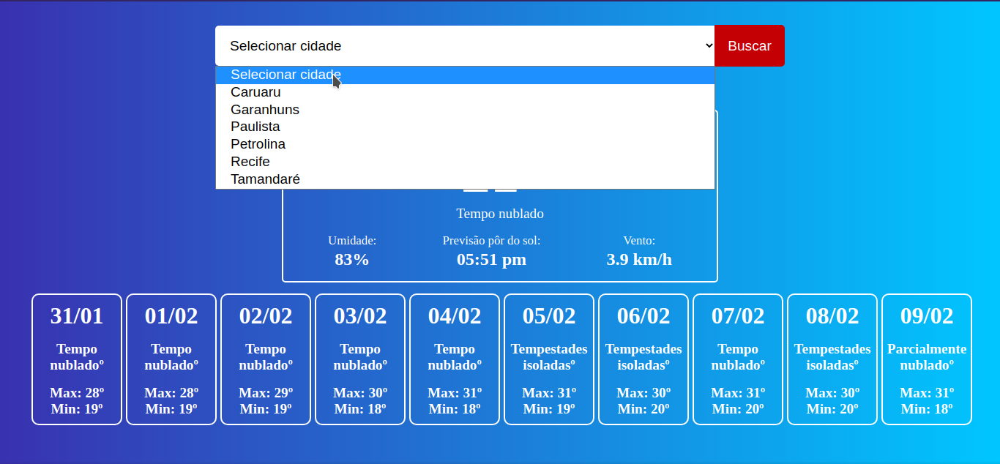

# Consumindo-API-PrevisaoTempo
 Projeto web para buscar informações sobre previsões do tempo e dados climáticos de algumas cidades do estado de pernambuco, utilizando PHP e a Api HG Weather.

 <a target="_blank" href="https://console.hgbrasil.com/documentation/weather">Documentação da Api HG Weather</a> 
 
 
Para realizar a busca na Api, é necessário informar o código da cidade, que pode ser consultado <a target="_blank" href="https://console.hgbrasil.com/documentation/weather/tools">Nesse link</a>.  Como o objetivo era apenas consumir os dados a nível de estudo e prática eu decidi inserir apenas algumas cidades no projeto.

 <h3>Requisitos:</h3>
    <blockquote>
       Ter o curl instalado (em sistemas operacionais linux por exemplo). E nos demais ter as extensões <code>extension=curl.so</code> <code>extension=curl</code> ativados no arquivo ini do seu php. <a href="https://www.php.net/manual/pt_BR/curl.installation.php">Como aplicar os procedimentos de acordo com sistema operacinal</a>
    </blockquote>
 <h3>Instalação: </h3>
<blockquote>
    clonar este repositório para a pasta do seu servidor (xampp, wamp ou lamp) e executar apartir do localhost. Caso utiliza o servidor do php basta navegar até a pasta do projeto pelo cmd e digitar o comando: <code>php -S localhost:8080</code>
</blockquote>

<h3>Imagens do projeto</h3>

<figure>
 	<figcaption>Buscando por cidades</figcaption>
    
    
</figure>
<figure>
 	<figcaption>Cidades disponíveis</figcaption>
    
</figure>